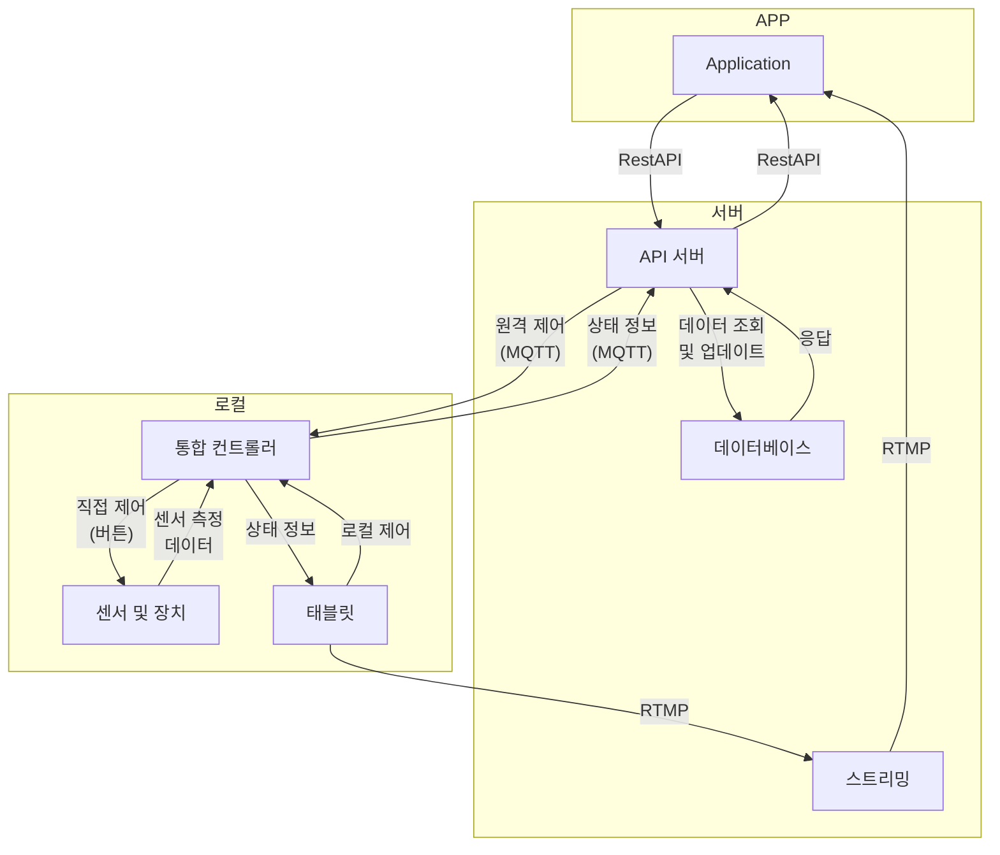

1. **클라이언트 애플리케이션 (Client):**

- 사용자 인터페이스(App)를 통해 사용자의 요청
- 서버에 JSON 형식으로 전송
- 클라이언트는 자동 상태일때만 제어 가능(컨트롤러 스위치를 자동으로 바꿔주세요)
- 

2. **서버 (Server):**

- API 서버가 클라이언트의 요청을 처리
- 필요한 데이터를 데이터베이스(DB)에서 조회하거나 업데이트
- 서버는 JSON 형식으로 응답을 클라이언트에 전송

3. **통합 컨트롤러 (Controller):**

- 센서 및 장치로부터 환경 데이터를 수집 
- 데이터를 JSON 형식으로 서버에 전송
- 서버로부터 받은 제어 명령을 센서 및 장치에 전달

4. **태블릿:**
- 컨트롤러 직접 제어
- 태블릿에 부착된 카메라로 CCTV 실시간 스트리밍

