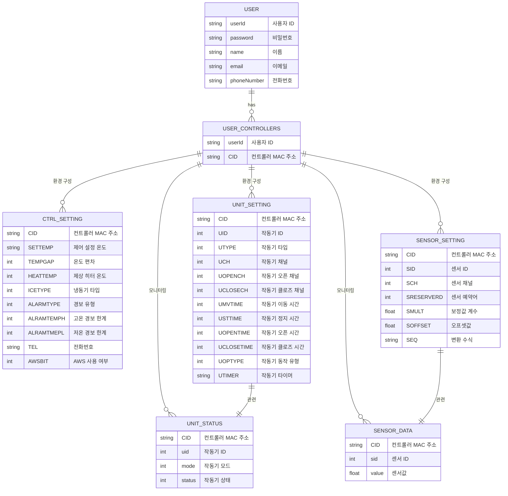

# Database Design

### 1. USER

| 컬럼명         | 자료형    | 설명     | 비고 |
|-------------|--------|--------|----|
| userId      | string | 사용자 ID | PK |
| password    | string | 비밀번호   |    |
| name        | string | 이름     |    |
| email       | string | 이메일    |    |
| phoneNumber | string | 전화번호   |    |  
| authority  | string | 권한     |    |  

### 2. USER_CONTROLLERS

| 컬럼명    | 자료형    | 설명          | 비고 |
|--------|--------|-------------|----|
| userId | string | 사용자 ID      | FK |
| CID    | string | 컨트롤러 MAC 주소 | PK |  

### 3. CTRL_SETTING

| 컬럼명        | 자료형    | 설명          | 비고 |
|------------|--------|-------------|----|
| CID        | string | 컨트롤러 MAC 주소 | FK |
| SETTEMP    | string | 제어 설정 온도    |    |
| TEMPGAP    | int    | 온도 편차       |    |
| HEATTEMP   | int    | 제상 히터 온도    |    |
| ICETYPE    | int    | 냉동기 타입      |    |
| ALARMTYPE  | int    | 경보 유형       |    |
| ALRAMTEMPH | int    | 고온 경보 한계    |    |
| ALRAMTMEPL | int    | 저온 경보 한계    |    |
| TEL        | string | 전화번호        |    |
| AWSBIT     | int    | AWS 사용 여부   |    |

### 4. UNIT_SETTING

| 컬럼명        | 자료형    | 설명          | 비고 |
|------------|--------|-------------|----|
| CID        | string | 컨트롤러 MAC 주소 | FK |
| UID        | int    | 작동기 ID      |    |
| UTYPE      | int    | 작동기 타입      |    |
| UCH        | int    | 작동기 채널      |    |
| UOPENCH    | int    | 작동기 오픈 채널   |    |
| UCLOSECH   | int    | 작동기 클로즈 채널  |    |
| UMVTIME    | int    | 작동기 이동 시간   |    |
| USTTIME    | int    | 작동기 정지 시간   |    |
| UOPENTIME  | int    | 작동기 오픈 시간   |    |
| UCLOSETIME | int    | 작동기 클로즈 시간  |    |
| UOPTYPE    | int    | 작동기 동작 유형   |    |
| UTIMER     | string | 작동기 타이머     |    |

### 5. SENSOR_SETTING

| 컬럼명        | 자료형    | 설명          | 비고 |
|------------|--------|-------------|----|
| CID        | string | 컨트롤러 MAC 주소 | FK |
| SID        | int    | 센서 ID       |    |
| SCH        | int    | 센서 채널       |    |
| SRESERVERD | int    | 센서 예약어      |    |
| SMULT      | float  | 보정값 계수      |    |
| SOFFSET    | float  | 오프셋값        |    |
| SEQ        | string | 변환 수식       |    |

### 6. SENSOR_DATA

| 컬럼명   | 자료형    | 설명          | 비고 |
|-------|--------|-------------|----|
| CID   | string | 컨트롤러 MAC 주소 | FK |
| sid   | int    | 센서 ID       |    |
| value | float  | 센서값         |    |

### 7. UNIT_STATUS

| 컬럼명    | 자료형    | 설명          | 비고 |
|--------|--------|-------------|----|
| CID    | string | 컨트롤러 MAC 주소 | FK |
| uid    | int    | 작동기 ID      |    |
| mode   | int    | 작동기 모드      |    |
| status | int    | 작동기 상태      |    |

5. 비고
    - 한 사용자가 여러 컨트롤러를 소유할 수 있으며, 각 컨트롤러가 여러 장치들을 관리하는 구조.
    - 각 컨트롤러는 여러 설정 및 상태 정보를 가짐
    - 이 정보들은 사용자 컨트롤러 테이블을 통해 사용자에게 연결됨.
