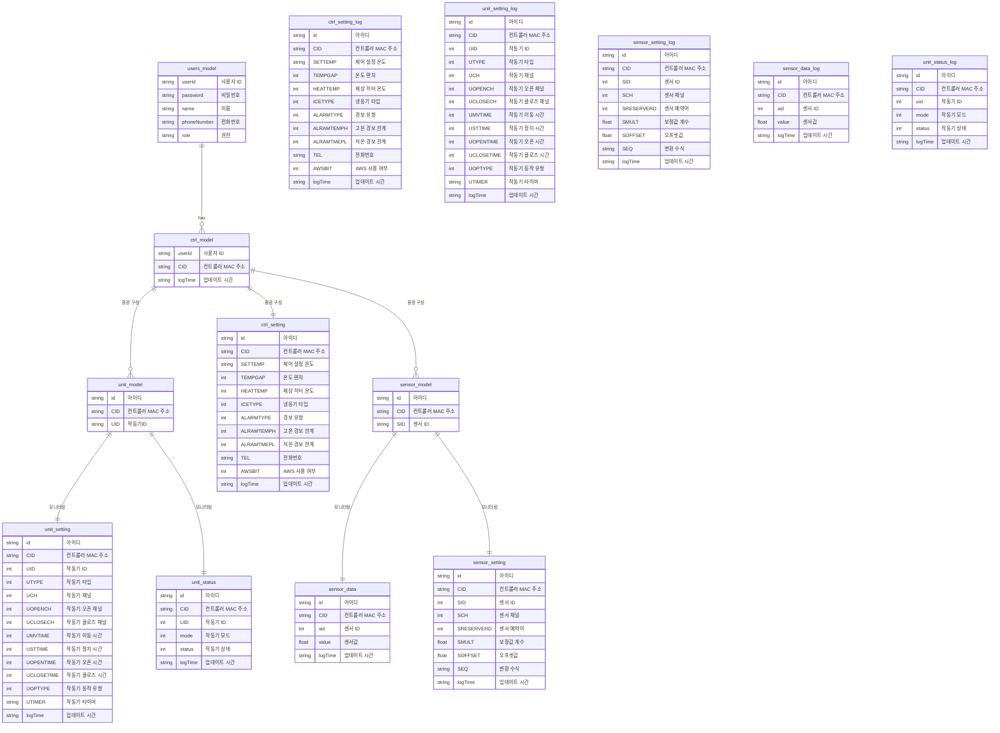

# Database Design

```mermaid
erDiagram
    users_model ||--o{ ctrl_model: "has"
    ctrl_model ||--o{ unit_model: "환경 구성"
    ctrl_model ||--|| ctrl_setting: "환경 구성"
    ctrl_model ||--o{ sensor_model: "환경 구성"
    sensor_model ||--|| sensor_data: "모니터링"
    sensor_model ||--|| sensor_setting: "모니터링"
    unit_model ||--|| unit_setting: "모니터링"
    unit_model ||--|| unit_status: "모니터링"

    users_model {
        string userId "사용자 ID"
        string password "비밀번호"
        string name "이름"
        string phoneNumber "전화번호"
        string role "권한"
    }
    ctrl_model {
        string userId "사용자 ID"
        string CID "컨트롤러 MAC 주소"
        string logTime  "업데이트 시간"
    }
    ctrl_setting {
        string id "아이디"
        string CID "컨트롤러 MAC 주소"
        string SETTEMP "제어 설정 온도"
        int TEMPGAP "온도 편차"
        int HEATTEMP "제상 히터 온도"
        int ICETYPE "냉동기 타입"
        int ALARMTYPE "경보 유형"
        int ALRAMTEMPH "고온 경보 한계"
        int ALRAMTMEPL "저온 경보 한계"
        string TEL "전화번호"
        int AWSBIT "AWS 사용 여부"
        string logTime  "업데이트 시간"
    }
    ctrl_setting_log {
        string id "아이디"
        string CID "컨트롤러 MAC 주소"
        string SETTEMP "제어 설정 온도"
        int TEMPGAP "온도 편차"
        int HEATTEMP "제상 히터 온도"
        int ICETYPE "냉동기 타입"
        int ALARMTYPE "경보 유형"
        int ALRAMTEMPH "고온 경보 한계"
        int ALRAMTMEPL "저온 경보 한계"
        string TEL "전화번호"
        int AWSBIT "AWS 사용 여부"
        string logTime  "업데이트 시간"
    }
    unit_model {
        string id "아이디"
        string CID "컨트롤러 MAC 주소"
        string UID "작동기ID"
    }
    unit_setting {
        string id "아이디"
        string CID "컨트롤러 MAC 주소"
        int UID "작동기 ID"
        int UTYPE "작동기 타입"
        int UCH "작동기 채널"
        int UOPENCH "작동기 오픈 채널"
        int UCLOSECH "작동기 클로즈 채널"
        int UMVTIME "작동기 이동 시간"
        int USTTIME "작동기 정지 시간"
        int UOPENTIME "작동기 오픈 시간"
        int UCLOSETIME "작동기 클로즈 시간"
        int UOPTYPE "작동기 동작 유형"
        string UTIMER "작동기 타이머"
        string logTime  "업데이트 시간"
    }
    unit_setting_log {
        string id "아이디"
        string CID "컨트롤러 MAC 주소"
        int UID "작동기 ID"
        int UTYPE "작동기 타입"
        int UCH "작동기 채널"
        int UOPENCH "작동기 오픈 채널"
        int UCLOSECH "작동기 클로즈 채널"
        int UMVTIME "작동기 이동 시간"
        int USTTIME "작동기 정지 시간"
        int UOPENTIME "작동기 오픈 시간"
        int UCLOSETIME "작동기 클로즈 시간"
        int UOPTYPE "작동기 동작 유형"
        string UTIMER "작동기 타이머"
        string logTime  "업데이트 시간"
    }
    sensor_model {
        string id "아이디"
        string CID "컨트롤러 MAC 주소"
        string SID "센서 ID"
    }
    sensor_setting {
        string id "아이디"
        string CID "컨트롤러 MAC 주소"
        int SID "센서 ID"
        int SCH "센서 채널"
        int SRESERVERD "센서 예약어"
        float SMULT "보정값 계수"
        float SOFFSET "오프셋값"
        string SEQ "변환 수식"
        string logTime  "업데이트 시간"
    }
    sensor_setting_log {
        string id "아이디"
        string CID "컨트롤러 MAC 주소"
        int SID "센서 ID"
        int SCH "센서 채널"
        int SRESERVERD "센서 예약어"
        float SMULT "보정값 계수"
        float SOFFSET "오프셋값"
        string SEQ "변환 수식"
        string logTime  "업데이트 시간"
    }
    sensor_data {
        string id "아이디"
        string CID "컨트롤러 MAC 주소"
        int sid "센서 ID"
        float value "센서값"
        string logTime  "업데이트 시간"
    }
    sensor_data_log {
        string id "아이디"
        string CID "컨트롤러 MAC 주소"
        int sid "센서 ID"
        float value "센서값"
        string logTime  "업데이트 시간"
    }
    unit_status {
        string id "아이디"
        string CID "컨트롤러 MAC 주소"
        int UID  "작동기 ID"
        int mode "작동기 모드"
        int status "작동기 상태"
        string logTime  "업데이트 시간"
    }
    unit_status_log {
        string id "아이디"
        string CID "컨트롤러 MAC 주소"
        int uid "작동기 ID"
        int mode "작동기 모드"
        int status "작동기 상태"
        string logTime  "업데이트 시간"
    }
```

### 비고
    - 한 사용자가 여러 컨트롤러를 소유할 수 있으며, 각 컨트롤러가 여러 장치들을 관리하는 구조.
    - 각 컨트롤러는 여러 설정 및 상태 정보를 가짐
    - 이 정보들은 사용자 컨트롤러 테이블을 통해 사용자에게 연결됨.
