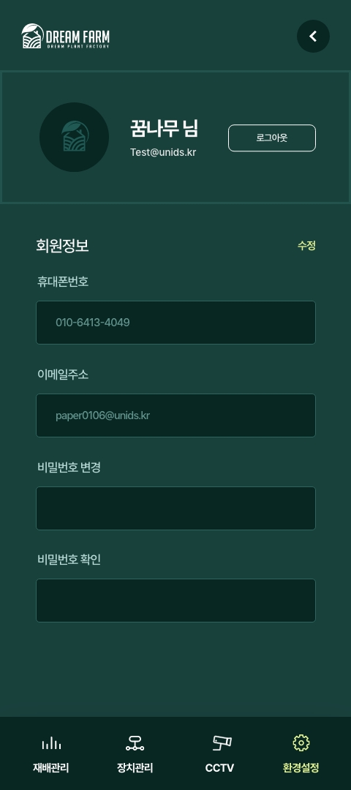

# 드림팜 요구사항 명세서

### 1. 메인화면 & 로그인
- **로딩화면**
  - 로딩바(직선?원형 필요한지?)    
    
- **로그인 기능**
  - 사용자는 이메일과 비밀번호를 입력하여 로그인
  - '로그인 유지하기', '아이디 저장' 체크박스 제공
  - 로그인 실패 시, 오류 메시지 출력
  - 비밀번호 입력란 옆에 '비밀번호 보기' 아이콘 제공
      
- **아이디 / 비밀번호 찾기**
  - '아이디 찾기' : 이름, 전화번호 검증 후 제공
  - '비밀번호 찾기' : 
    - 이름, 전화번호, 아이디, 검증 후 이메일 임시번호 전송,
    - 이메일 전송 확인 메시지 출력
    - 임시번호 인증 후 새로 생성
        

  
    

### 2. 환경 모니터링 및 제어
- **실시간 모니터링**
  - 대시보드에 실시간 온도, 습도, CO2 농도 등 표시
  - 각 환경 요소별 그래픽 표시
  - 환경 데이터에 대한 시간별, 일별, 주별 이력 조회 기능
  - 실시간 데이터 업데이트 간격 선택 기능? (예: 1분, 5분, 15분 -- 정보 확인 후 갱신)
        
  

### 3. 장치 관리

- **장치 상태**
  - 각 장치(예: LED, 차광막)의 현재 상태 표시 (켜짐 / 꺼짐)
      
- **장치 제어**
  - 자동 모드 및 수동 모드 전환 스위치
    - 설정된 스케줄에 따른 자동 작동 옵션
        
- **개별 환경 제어**
  - 각 환경 요소별 시간제어 슬라이더 제공
  - 설정값 저장 기능
  - 설정한 값으로 자동 조절 기능 활성화 / 비활성화 스위치
  - 가장 아래부분 적용 버튼 추가(?)
      

  
  

### 4. CCTV 기능

- **CCTV 실시간 확인**
  - 선택된 CCTV 영상을 실시간으로 스트리밍
  - 태블릿 내장 카메라 이용, 컨트롤러 1대당 1개
  - 컨트롤러 선택 드롭다운 메뉴 제공
  - 남아 있는 모든 카메라 일시정지? 재생? 여부(재생중 카메라 제외)
  - 선택된 카메라의 영상 표시
      
- **CCTV 관리**
  - 카메라 추가 및 삭제 기능
      

    
    

### 5. 사용자 정보 관리

- **프로필 정보 수정**
  - 사용자 프로필 정보(이름, 이메일, 전화번호) 수정 가능
  - 변경 사항 적용 시 확인 메시지 출력
  - '수정' 버튼으로 변경 사항 적용
      
- **비밀번호 변경**
  - 현재 비밀번호와 새 비밀번호 입력 필드 제공
  - '비밀번호 변경' 버튼으로 새 비밀번호 적용
  - 비밀번호 변경 성공 시 확인 메시지 출력  
  

