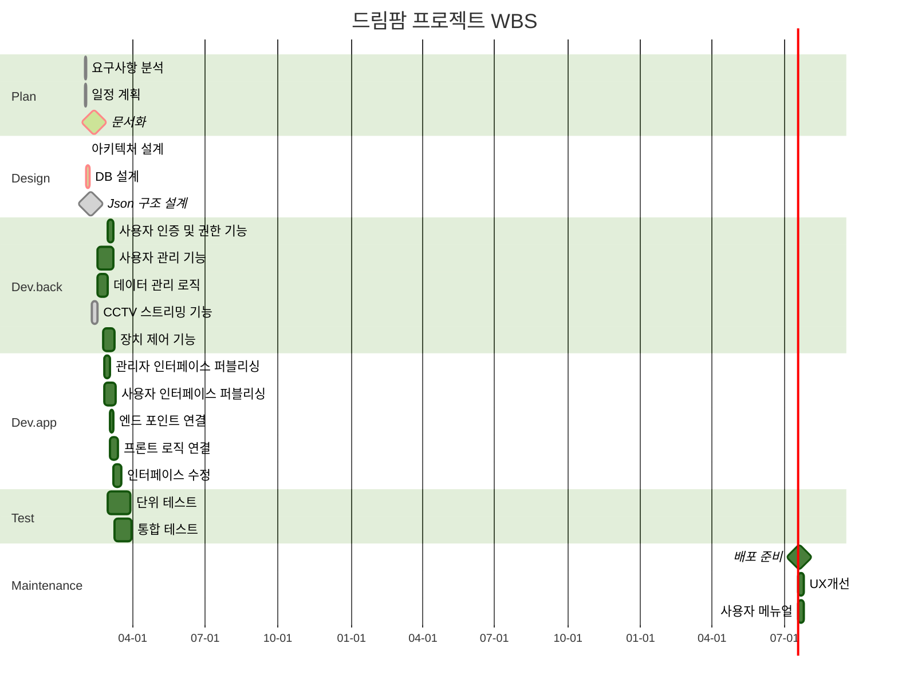

```mermaid
%%{init: {'theme': 'forest', 'themeVariables': { 'primaryColor': '#9fb5b4' },'displaymode':'compact'}}%%
gantt
    dateFormat YYMMDD
%%    excludes weekends
    title 드림팜 프로젝트 WBS
    axisFormat %m-%d

    section Plan
        요구사항 분석: done,  pl1, 240201, 1d
        일정 계획: done, pl2, 240201, 2d
        문서화: milestone, crit, active, pl3, after pl1, 3w

    section Design
        아키텍처 설계: done, des1, after pl1, 1d
        DB 설계: crit, active, des2, after pl2, 3d
        Json 구조 설계: milestone, done, des3, after des2, 3d

    section Dev.back
        사용자 인증 및 권한 기능: bk2, after bk3, 1w
        사용자 관리 기능: bk1, after bk5, 3w
        데이터 관리 로직: bk3, after bk5, 2w
        CCTV 스트리밍 기능: done,bk5, after des3, 1w
        장치 제어 기능: bk4, 240224, 2w

    section Dev.app
        관리자 인터페이스 퍼블리싱: fr3, 240225, 1w
        사용자 인터페이스 퍼블리싱: fr1, 240225 , 2w
        엔드 포인트 연결: fr2, after fr3, 0.5w
        프론트 로직 연결: fr5, after fr3, 1.5w
        인터페이스 수정: fr4, after fr2, 1.5w

    section Test
        단위 테스트: tes1, after bk3, 4w
        통합 테스트: tes2, after bk4, 3w

    section Maintenance
        배포 준비: milestone, mt1, after des8, 3d
        UX개선: mt2, after des8, 1w
        사용자 메뉴얼: mt3, after des8, 1w


```

#### 참고

- 각 과정마다 검토와 수정 과정이 병행됨.
- 각 과정에 따른 문서는 모두 Documents 폴더 안에 있음